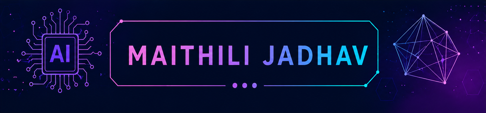

  

<h1 align="center">Hi 👋, I'm Maithili Jadhav</h1>

<h3 align="center">
B.Tech Artificial Intelligence & Data Science Student
</h3>

💻 Technology Enthusiast • 📊 Exploring Data Analytics • 🤖 Artificial Intelligence

---

## 👩‍💻 About Me

🎓 B.Tech Student in **Artificial Intelligence & Data Science**

💻 Interested in **Artificial Intelligence, Data Analytics, Machine Learning & Software Development**

🚀 Passionate about building practical technology solutions

📚 Continuously learning through academics and personal projects

🌱 Always exploring new tools and technologies

---

## 🛠️ Tech Stack

### 💻 Programming Languages

  

### 🌐 Web Technologies

  

### ⚙️ Technologies

  

### 🛠️ Tools & Platforms

  

## 🚀 Featured Projects

### 💧 IoT Based Water Canal Distribution System

- Developed an IoT-based smart water distribution and monitoring system.
- Implemented real-time monitoring for efficient water management.
- Built using IoT and web technologies.

**Technologies:**

**💻 Software Technologies**

HTML | CSS | JavaScript | Java | MySQL | XAMPP

**🔧 Hardware Technologies**

Arduino Uno | Solenoid Valve | Water Flow Sensor

---

## 📊 GitHub Statistics

---

## 🏆 Achievements & Learning

✨ Completed Diploma in Information Technology
✨ Currently pursuing B.Tech in Artificial Intelligence & Data Science
✨ Developed IoT-based academic projects
✨ Building practical skills in Python, SQL, Git and GitHub
✨ Continuously improving programming and problem-solving skills

---

## 🏆 Skills

---

## 📫 Connect With Me

---

### ⭐ *"Learning today, building tomorrow."* 🚀

