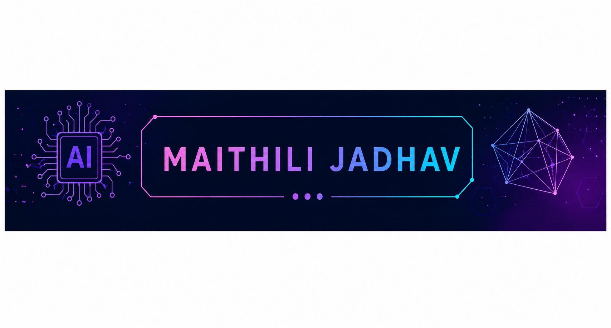

  

# Hi 👋, I'm Maithili Jadhav

### Artificial Intelligence & Data Science Student | Technology Enthusiast | Exploring Data Analytics & AI

---

## 👩‍💻 About Me

🎓 B.Tech Student in Artificial Intelligence & Data Science

💻 Interested in Data Analytics, Artificial Intelligence, Machine Learning and Software Development

🚀 Passionate about learning new technologies and building practical projects

📚 Continuously exploring programming, data analysis and AI concepts

🌱 Always eager to learn and improve my technical skills

---

## 🛠️ Tech Stack

### Programming Languages
- Python
- SQL
- JavaScript

### Data Analytics & AI
- Power BI
- Machine Learning (Basics)
- Data Visualization

### Tools & Platforms
- Git
- GitHub
- VS Code
- Jupyter Notebook
- Google Colab

---

## 🚀 Featured Projects

### 💧 IoT Based Water Canal Distribution System

- Developed an IoT-based smart water distribution and monitoring system.
- Implemented real-time monitoring for efficient water management.
- Worked with ESP32, web technologies and IoT concepts.

**Technologies Used**

ESP32 • JavaScript • HTML • CSS • IoT

---

## 🏆 Achievements & Learning

✨ Pursuing B.Tech in Artificial Intelligence & Data Science

✨ Building practical programming and IoT projects

✨ Exploring Data Analytics and Artificial Intelligence

✨ Learning through academic and personal projects

---

## 🏆 Skills

- Python
- SQL
- Power BI
- Git & GitHub
- Problem Solving
- Teamwork
- Communication

---

## 📫 Connect With Me

📧 Email: **maithilijadhav2006@gmail.com**

💼 LinkedIn: *www.linkedin.com/in/maithili-jadhav-047871310*

---

### ⭐ "Learning today, building tomorrow." 🚀
